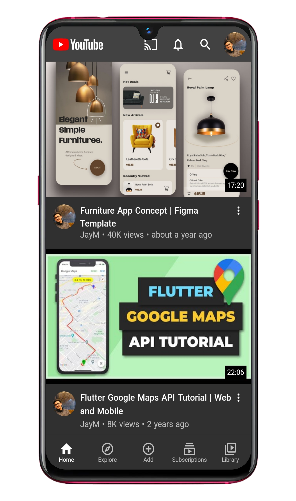
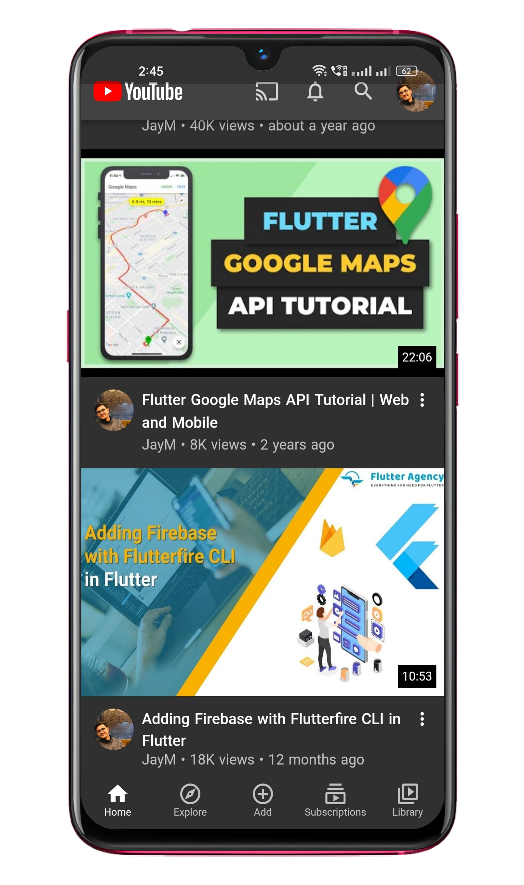
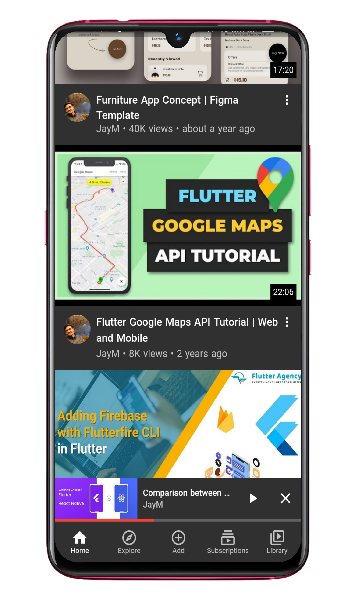
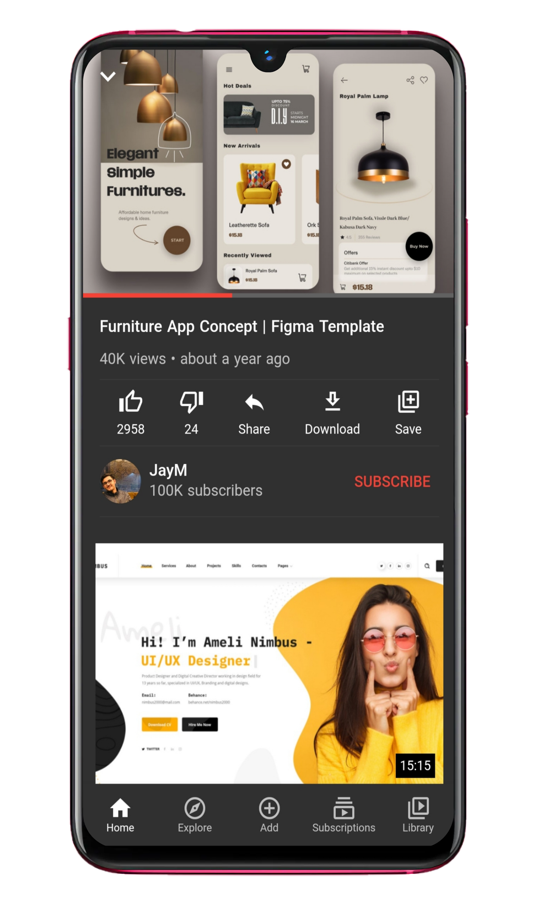
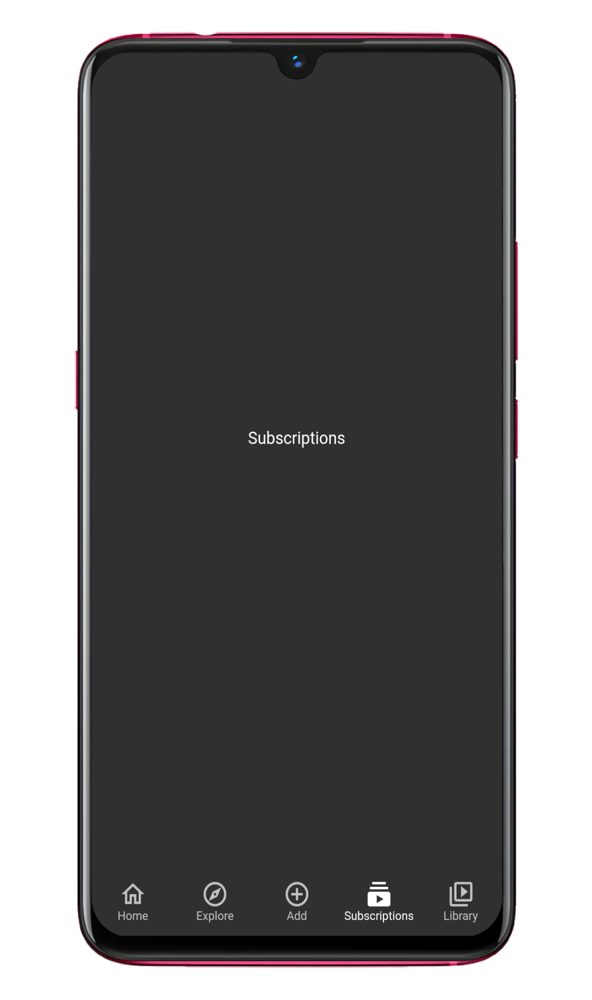
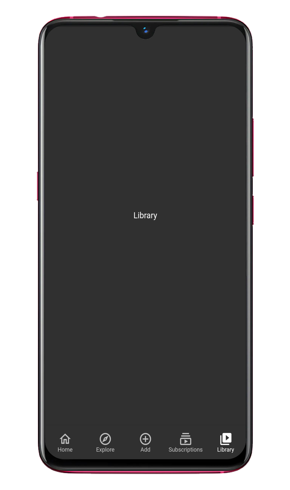
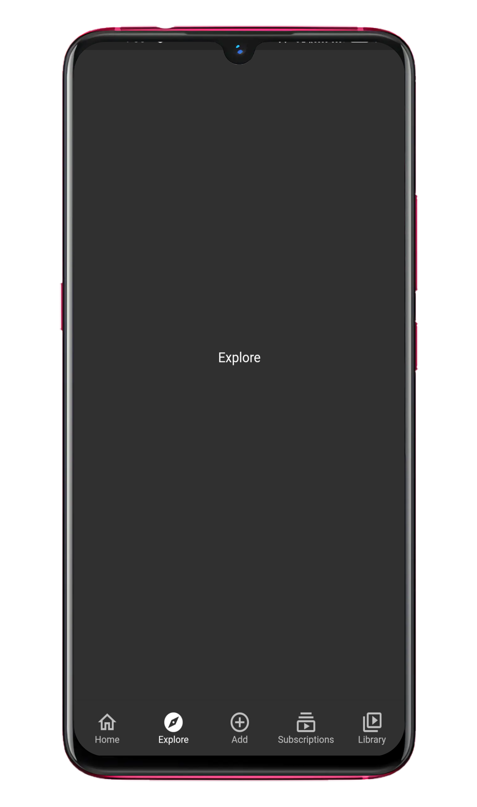

<h1 align="center">Youtube-Clone-UI
  

</h1>

## 📱The App:
Youtube Clone UI is a visually stunning Flutter app that mimics the user interface of the famous video-sharing platform, YouTube. 
It offers a similar look and feel, allowing users to explore videos in an immersive and familiar environment.
While it focuses on the UI aspect, it does not include the full functionality of the actual YouTube app.

## 📲Home Screen:

On the home screen of the application, you'll find a user interface similar to that of the YouTube app.
The screen includes a SliverAppBar at the top, providing a scrolling app bar functionality.
The SliverAppBar may have a title or a logo and can adjust its behavior as the user scrolls through the content.

Below the SliverAppBar, you'll see video cards displayed using video card packages.
Video cards are widgets that present a visual representation of a video along with relevant information, such as the video title, thumbnail, duration, and views.
These packages provide an organized and appealing layout for displaying multiple videos in a scrollable list.

|               Image 1                         |                  Image 2                  |             
| :-------------------------------------------: | :---------------------------------------: | 
|              |          | 

## 🔎Mini Player Screen:
Using Riverpod for state management, when a user taps on a video, the selected video state updates with the chosen video.
On the other hand, tapping the "x" button sets the selected video state to null, indicating no video is selected or the mini player is closed.
Riverpod enables efficient state updates and ensures a seamless user experience based on user interactions.

|                              Mini Player Screen                         |
| :--------------------------------------------------------------------:  |
|  |

## 📇Video Screen:
At the top of the Video Screen, users will find a thumbnail image representing the video being played.
The thumbnail provides a visual preview of the content and helps users identify the video at a glance.
Below the thumbnail, there is a linear progress indicator that indicates the progress of the video being played.
This feature allows users to track their progress within the video and provides a visual representation of the elapsed time.

On the top-left corner of the screen, there is an icon that users can tap to dismiss the video screen.
This icon provides a convenient way for users to exit the video playback and return to the previous screen or continue exploring other videos.
Additionally, the Video Screen includes a Sliver List, which allows users to continuously scroll through the screen.
The Sliver List provides a seamless and immersive browsing experience by presenting a list of videos or related content that users can explore while watching the current video.

|                              Video Screen                               |
| :--------------------------------------------------------------------:  |
|  |

## 👤 Navigation Screens:
The navigation screen allows users to navigate between different sections of the app using the bottom navigation bar.
The screens accessible through the navigation bar include:

Home: Provides personalized content and recommendations.
Explore: Allows users to discover new content and explore categories.
Add: Enables users to upload and share their own content.
Subscription: Manages subscription preferences and premium features.
Library: Organizes and provides access to saved items and playlists.

Please note that, except for the home screen, the other screens currently do not have a user interface implemented.
However, they can be developed and added later to enhance the functionality and user experience of the app.

|             Subscriptions                     |                Library                    |                 Explore                  | 
| :-------------------------------------------: | :---------------------------------------: | :---------------------------------------:|
|             |          |         |

## :rocket: Resources:
- [Flutter Official Docs](https://flutter.dev/docs)
- [Flutter Community Medium](https://medium.com/flutter-community)
- [Riverpod Docs](https://riverpod.dev/docs/getting_started)
- [Sliver AppBar class](https://api.flutter.dev/flutter/material/SliverAppBar-class.html)

